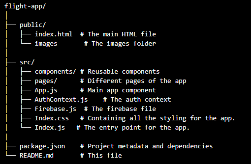

# ONLINE-BOOK-STORE - Books

Welcome to Books, a React.js-based e-commerce platform where users can browse, search, and purchase books from various categories. The application is designed to provide an intuitive shopping experience with features like a dynamic carousel, a category-based filtering, addition of items to a wishlist, and a fully functional shopping cart.

## Table of Contents

- [Overview](#overview)
- [Features](#features)
- [Demo](#demo)
- [Technologies Used](#technologies-used)
- [Getting Started](#getting-started)
  - [Prerequisites](#prerequisites)
  - [Installation](#installation)
  - [Running the App](#running-the-app)
  - [Building the App](#building-the-app)
- [Deployment](#deployment)
- [Project Structure](#project-structure)
- [Contributing](#contributing)
- [Troubleshooting](#troubleshooting)
- [License](#license)

## overview

Books is a comprehensive platform where users can:

- Search and purchase books.
- Explore books by categories.
- Add favorite books to a wish-list.
- Add books to a cart, which collects intended items for purchase.

The project is built with React and is designed to be fully responsive across different screen sizes.

## Features

- *Dynamic Carousel:* Displays the latest and trending books with their titles and descriptions.
- *Search Functionality:* Allows users to search for books by title or author.
- *Category Filtering:* Users can filter books by categories like Trending, Best Sellers, and Deals for Today.
- *Quantity Selector:* Users can select the quantity of each book before adding it to the cart.
- *Wishlist:* Toggle the heart icon to add or remove books from the wishlist.
- *Cart Management:* Easily add books to the cart, with the option to update quantities or remove items.
- *Responsive Design:* Optimized for both desktop and mobile devices.

## Demo

Check out a live demo of the project [here](https://ogbonnablessed.github.io/books/).

## Technologies Used

- *React.js:* A JavaScript library for building user interfaces.
- *Context API:* For managing global state, including the cart and wishlist.
- *CSS Modules:* For styling individual components.
- *Local Storage:* To persist cart and wishlist data across sessions.

## Getting Started

### Prerequisites

Before you begin, ensure you have the following installed on your local machine:

- [Node.js](https://nodejs.org/) (version 14.x or higher)
- [npm](https://www.npmjs.com/) (comes with Node.js)
- [Git](https://git-scm.com/)

Optionally, you can also have a code editor like [Visual Studio Code](https://code.visualstudio.com/) for a better development experience.

### Installation

1. *Clone the repository:*

   ```bash
   git clone https://github.com/ogbonnablessed/books.git
   ```
   

2. *Navigate to the project directory:*

   ```bash
   cd books
   ```
   

3. *Install the dependencies:*

   ```bash
   npm install
   ```
   

   This command will install all the necessary packages listed in the package.json file.

### Running the App

1. *Start the development server:*

   ```bash
   npm start
   ```
   

2. *View the application:*

   Open your browser and go to `http://localhost:3000` to see the application running. The development server will automatically reload any changes you make to the code.

### Building the App

1. *To create an optimized build for the application, run:*

   ```bash
   npm run build
   ```

## Deployment

1. *To deploy the application to GitHub Pages, use the following command:*

   ```bash
   npm run deploy
   ```

## Project structure




## Contributions

Contributions are welcome! If you'd like to contribute, please follow these steps:

1. **Fork the repository:**
   - Click on the "Fork" button at the top right of this page.

2. **Clone your fork:**

    ```bash
    git clone https://github.com/your-username/flight-app.git
    ```
   

3. **Create a new branch for your feature or bugfix:**

    ```bash
    git checkout -b feature/your-feature-name
    ```
    

4. **Make your changes and commit them:**

    ```bash
    git add .
    git commit -m "Description of the changes made"
    ```
   

5. **Push to your forked repository:**

    ```bash
    git push origin feature/your-feature-name
    ```

6. *Submit a pull request:*
   - Go to the original repository on GitHub, click on "Pull Requests," and submit your request for review.

## Troubleshooting

If you encounter any issues during setup or development, here are a few common solutions:

- *Issue:* Application fails to start after running npm start.
  - *Solution:* Ensure all dependencies are installed by running `npm install`. Check for any errors in the terminal for missing or outdated packages.

- *Issue:* Images or static files not displaying after deploying to GitHub Pages.
  - *Solution:* Make sure all paths in your code are relative, and double-check the image file names and paths.

## License

This project is licensed under the MIT License - see the [LICENSE](LICENSE) file for details.
